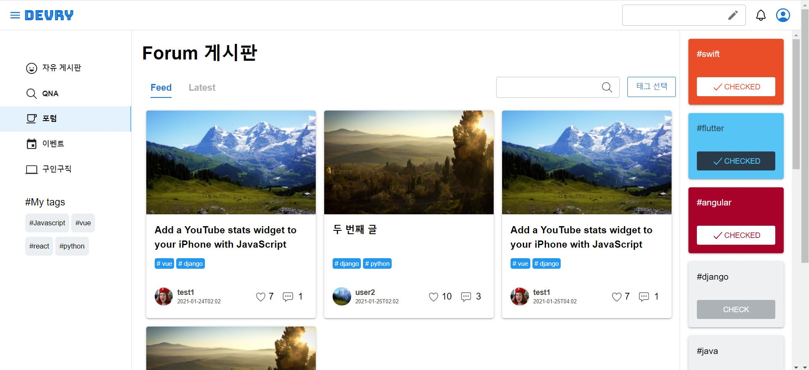
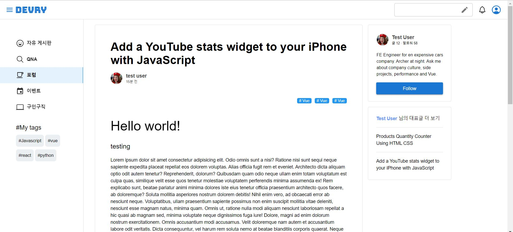
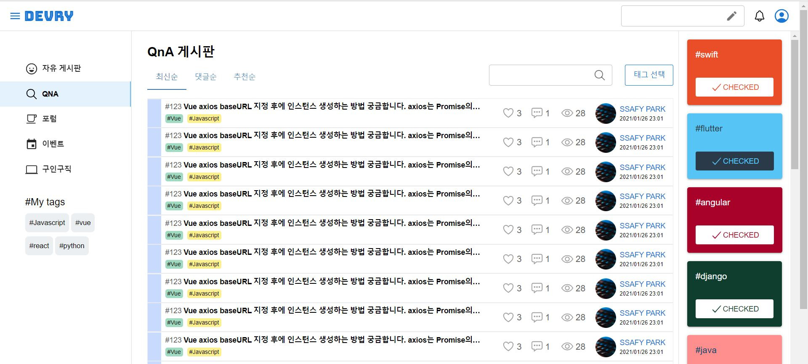
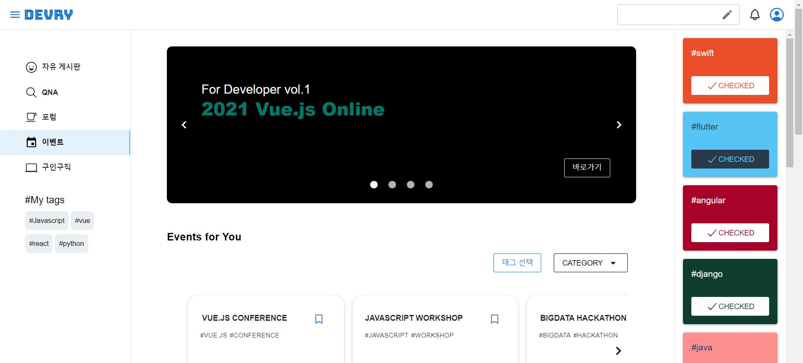
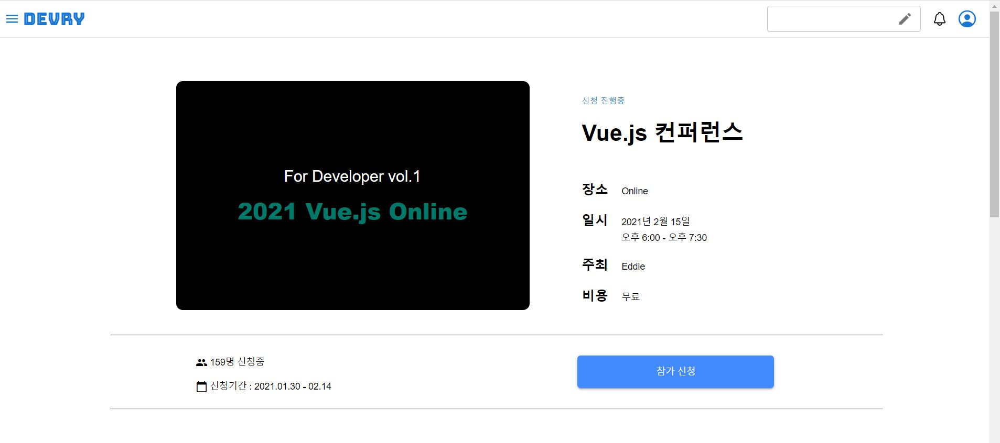
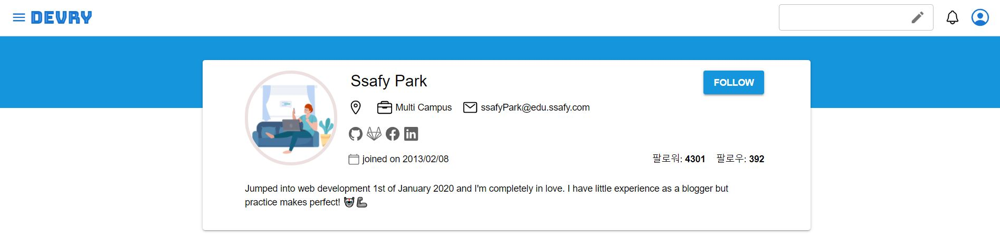
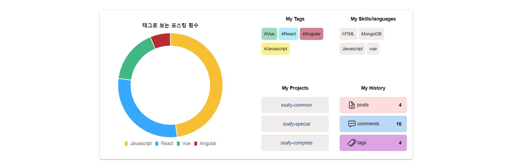
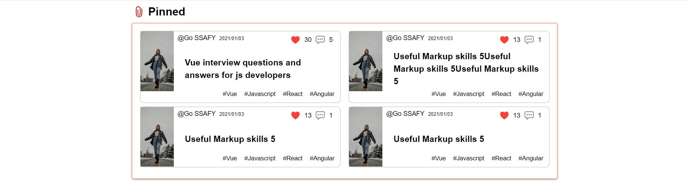
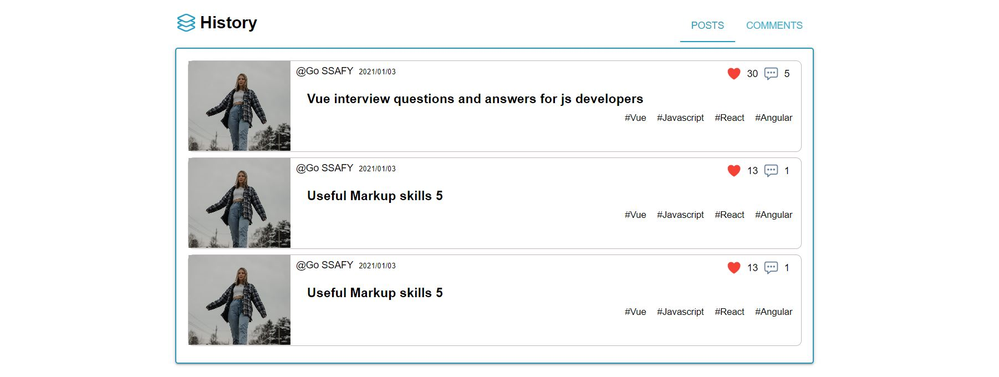

# Welcome to (미정)

// 이미지 위치 
## 🏠 [Homepage]()

 

## 👨‍👩‍👦팀원소개

**Dae Hyun Park**

- 🥪Github: [@daep93](https://github.com/daep93)

**Yoon Vin Kim**

- 🥨Github: [@vreez](https://github.com/vreez)

**Dae Yeong Jeong**

- 🥠Github: [@kingdom](https://github.com/kingdom)

**Hyeon Jun Nam**

- 🧀Github: [@applevalley](https://github.com/applevalley) 

**Si Eun Jeong**

- 🍤Github: [@sieun-iris](https://github.com/sieun-iris)

## 📆 프로젝트 개요

- **진행 기간**: 
	- sub-proj1: 2021.01.11 ~ 2020.01.15
	- sub-proj2: 2021.01.18 ~ 2022.01.22
	- sub-proj3: 2022.01.25 ~2020.02.19

- **목표**
  - 개발자 통합 커뮤니티 
  
## 📒 Tech Log
- Node.js 14.15.3
## 🔧 Tech Stack

## ⚙️ Install and Usage

### Frontend
#### Node Version Manager
- 맥: [NVM](https://github.com/joshua1988/vue-til-server#nvm-%EC%84%A4%EC%B9%98-%EB%B0%8F-%EB%B2%84%EC%A0%84-%EB%B3%80%EA%B2%BD-%EB%B0%A9%EB%B2%95)
- 윈도우: [NVM-window](http://hong.adfeel.info/backend/nodejs/window%EC%97%90%EC%84%9C-nvmnode-version-manager-%EC%82%AC%EC%9A%A9%ED%95%98%EA%B8%B0/)
#### vscode 플러그인
- Eslint
- Vetur
- Vue VSCode Snippets
- vue
- Vue 3 Snippets
- Vue Inline Templage
- Vue Peek
- Prettier를 혹시 설치했다면 해제할 것

### Backend

## 

## 👀 서비스 소개

**DEVRY란?**

DEVRY는 **개발자 특화 커뮤니티** 서비스와 **포트폴리오** 서비스를 결합한 개발자 SNS 플랫폼입니다.

`Developer` + `Everyone` 의 합성어로, 모든 개발자를 위한 공간이라는 뜻을 함축하고 있습니다.

 

**자세한 기획 배경 및 기능 소개가 궁금하다면?**

[DEVRY 기획/기능 명세서 바로가기](https://www.notion.so/DEVRY-9f3cc7c325694d2287e476160df50fc2)

 

## ⭐️ 주요 기능

### 1. 커뮤니티 기능

- DEVRY는 다섯 가지의 카테고리를 중심으로 커뮤니티가 구성되어 있으며, `#해시태그` 기반으로 강력한 세부 검색 기능을 제공합니다.
- 또한 SNS와 같이, 다른 사용자를 구독하는 기능을 제공합니다.

**① Forum**

> 기술 스택을 주제로 글을 작성하고, 공유하는 공간

- 태그 필터링 기능을 통해 원하는 기술 스택의 글만 선택해서 확인 가능
  - 왼쪽 카테고리 구역의 My tags에서 내가 팔로우하는 태그 고정, 페이지 이동 시 자동 필터링
- 작성자의 프로필 및 대표 글을 미리보기 형태로 제공, 관심 있을 경우 바로 팔로우 할 수 있도록 함
- 블로그에서 작성하는 것과 같이 편집 기능 제공

 

**② QnA**

> 질의응답을 할 수 있는 공간

- 태그 필터링 기능을 통해 원하는 기술 스택의 글만 선택해서 확인 가능
  - 왼쪽 카테고리 구역의 My tags에서 내가 팔로우하는 태그 고정, 페이지 이동 시 자동 필터링
- 답변 완료, 답변 대기 상태를 색깔로 구분 가능
- 질문자와 채택된 답변자의 프로필 및 대표 글을 미리보기 형태로 제공

 

**③ Event**

>  컨퍼런스 등 각종 이벤트 정보를 확인할 수 있는 공간

- 단체 또는 개인이 주최하는 모임 등록 가능
- 태그 필터링 기능을 통해 원하는 기술 스택의 이벤트만 선택해서 확인 가능
  - 왼쪽 카테고리 구역의 My tags에서 내가 팔로우하는 태그 고정, 페이지 이동 시 자동 필터링

 

**④ 구인구직**

>  채용 정보를 접할 수 있는 공간

***구현 예정***

 

**⑤ 자유 게시판**

> 주제 상관 없이 자유롭게 이야기를 나눌 수 있는 공간

***구현 예정***

 

 

### 2. 포트폴리오 기능

① 프로필 페이지

> 사용자의 프로필 정보를 보여주는 공간

**주요 내용**

- 유저가 설정한 개인정보
- 글에서 참조한 태그 통계
- 관심있는 기술 태그
- 맘에 드는 글 상단에 고정 (pinned 기능)
- 내가 쓴 글 또는 댓글을 시간 순으로 확인 가능

자신의 개발 이력 및 커뮤니티 활동 내역 요약을 통해, 마치 작은 블로그를 제공하는 것처럼 또 하나의 포트폴리오를 제공

 

①-1. 프로필 설정 페이지

>  프로필 페이지에 들어갈 정보를 추가 및 수정할 수 있는 공간

- 개발자에게 특화된 이력 입력폼 제공

 

①-2. 팔로우/팔로잉 모달

>  사용자의 팔로워/팔로잉 목록을 모달 형태로 열어서 확인할 수 있도록 구현

- 해당 화면에서 바로 팔로우 및 팔로우 취소 가능

 

 

### 3. 편집 기능 

***구현 예정***

- Forum, QnA 게시판 글 작성 시, 마크다운 에디터 지원
- 유튜브나 사진을 임베드할 수 있는 기능 제공
- 깃헙이나 깃랩의 레포를 임베드할 수 있는 기능 제공

