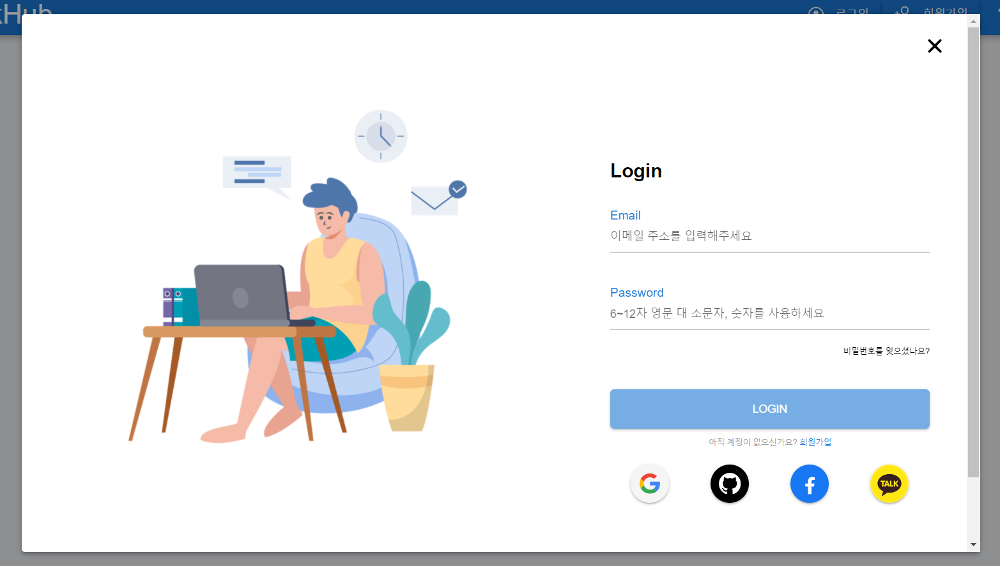
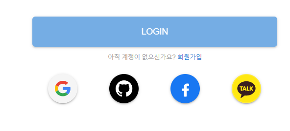
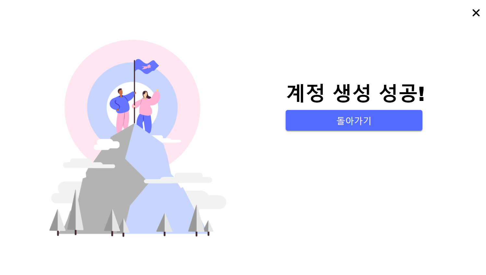

# Welcome to (미정)

// 이미지 위치 
## 🏠 [Homepage]()

 

## 👨‍👩‍👦팀원소개

**Dae Hyun Park**

- 🥪Github: [@daep93](https://github.com/daep93)

**Yoon Vin Kim**

- 🥨Github: [@vreez](https://github.com/vreez)

**Dae Yeong Jeong**

- 🥠Github: [@kingdom](https://github.com/kingdom)

**Hyeon Jun Nam**

- 🧀Github: [@applevalley](https://github.com/applevalley) 

**Si Eun Jeong**

- 🍤Github: [@sieun-iris](https://github.com/sieun-iris)

## 📆 프로젝트 개요

- **진행 기간**: 
	- sub-proj1: 2021.01.11 ~ 2020.01.15
	- sub-proj2: 2021.01.18 ~ 2022.01.22
	- sub-proj3: 2022.01.25 ~2020.02.19

- **목표**
  - 개발자 통합 커뮤니티 
  
## 📒 Tech Log
- Node.js 14.15.3
## 🔧 Tech Stack

## ⚙️ Install and Usage

### Frontend
#### Node Version Manager
- 맥: [NVM](https://github.com/joshua1988/vue-til-server#nvm-%EC%84%A4%EC%B9%98-%EB%B0%8F-%EB%B2%84%EC%A0%84-%EB%B3%80%EA%B2%BD-%EB%B0%A9%EB%B2%95)
- 윈도우: [NVM-window](http://hong.adfeel.info/backend/nodejs/window%EC%97%90%EC%84%9C-nvmnode-version-manager-%EC%82%AC%EC%9A%A9%ED%95%98%EA%B8%B0/)
#### vscode 플러그인
- Eslint
- Vetur
- Vue VSCode Snippets
- vue
- Vue 3 Snippets
- Vue Inline Templage
- Vue Peek
- Prettier를 혹시 설치했다면 해제할 것

### Backend

## ⭐️ 주요 기능
## 👀 페이지 소개
### Login

> 로그인 페이지 커스터마이징

1. 로그인 실패 시 사용자에게 실패 사유 에러메시지 표출

- 기본 화면: 
  - 모달 창을 통해 로그인 페이지 연결

- 로그인 에러 화면
  - 잘못된 형식의 입력값이 들어올 경우, 에러메시지 노출 및 라벨 색 변화
  - Login 버튼 비활성화 상태 유지
  - 각 입력칸 오른쪽에 X 버튼을 배치하여, 한 번에 입력값을 삭제할 수 있게 구현
  - 옳은 입력값이 들어올 경우, 라벨 색을 파란색으로 변경하여 시각적으로 확인할 수 있게 함

- 로그인 버튼 활성화
  - 이메일 형식 입력 및 비밀번화 입력 기존 충족 시 로그인 버튼 활성화

- 회원가입 페이지 바로 이동
  - 우측 하단의 '회원가입' 글씨 클릭 시 회원가입 페이지로 이동

회원가입 페이지로 이동한 모습

### Signup

> 회원가입 페이지 제작

1. 가입 필수 항목 체크

  - 모달 창을 통해 회원가입 페이지 연결
  - 가입 필수 항목이 채워지지 않으면 회원가입 버튼이 비활성화 유지

2. 항목 양식 체크
  - 항목에 따른 적절한 양식을 넣지 않으면 오류 메세지 출력

3. 로그인 화면으로 이동하기
4. 회원가입 성공 페이지

